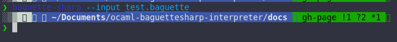
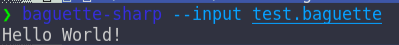
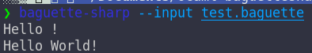
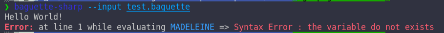
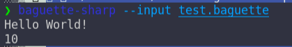
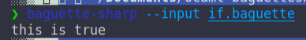

# Advanced Usage
[Skip To Content](#introduction)
## Table of Contents
- [Main Page](index.md#)
  - [Requirements](index.md#requirements)
  - [History](index.md#history)
  - [Support](index.md#support)
  - [Building](index.md#building)
  - [Install](index.md#install)
  - [Usage](index.md#usage)
  - [Test](index.md#test)
- [REPL](repl.md#repl)
  - [Links](repl.md#links)
  - [Prerequisite](repl.md#prerequisite)
  - [General command line](repl.md#general-command-line)
    - [REPL Commands](repl.md#repl-commands)
  - [REPL](repl.md#repl-1)
    - [Variable](repl.md#variable)
    - [Hinting](repl.md#hinting)
    - [Auto-completion](repl.md#auto-completion)
  - [Command Line](repl.md#command-line)
  - [Errors](repl.md#errors)
    - [Wrong Type](repl.md#wrong-type)
    - [Syntax](repl.md#syntax)
    - [List of errors](repl.md#list-of-errors)
- [Basic Usage](basic.md#basic-usage)
  - [Links](basic.md#links)
  - [Support](basic.md#support)
  - [IO](basic.md#io)
  - [Mathematics](basic.md#mathematics)
  - [Boolean algebra](basic.md#boolean-algebra)
    - [Booleans](basic.md#booleans)
    - [Algebra](basic.md#algebra)
  - [Array Manipulations](basic.md#array-manipulations)
  - [String Manipulations](basic.md#string-manipulations)
    - [Conversion from string](basic.md#conversion-from-string)
    - [Conversion to string](basic.md#conversion-to-string)
  - [Variables](basic.md#variables)
- [Advanced Usage](#advanced-usage)
  - [Introduction](#introduction)
  - [Labels](#labels)
  - [GOTOs](#gotos)
    - [Order of execution](#order-of-execution)
  - [Errors](#errors)
  - [Variables and Labels](#variables-and-labels)
  - [IFs](#ifs)
- [Random Guessing Game](random.md#random-guessing-game)
  - [Specifications](random.md#specifications)
  - [Initialization of the game](random.md#initialization-of-the-game)
    - [Welcome](random.md#welcome)
    - [Generation of the number to guess](random.md#generation-of-the-number-to-guess)
    - [Declarations](random.md#declarations)
  - [The Game Loop](random.md#the-game-loop)
    - [A Step](random.md#a-step)
    - [The Loop](random.md#the-loop)
-  [Binary Turing Machine](turing.md#binary-turing-machine)
   - [Introduction](turing.md#introduction)
   - [Specification](turing.md#specification)
   - [Initialization](turing.md#initialization)
   - [Program reading](turing.md#program-reading)
   - [One Step](turing.md#one-step)
   - [The Main Loop](turing.md#the-main-loop)
- [Binary Turing Machine Examples](turing.md#examples)
  - [Left Bit Shift](turing.md#left-bit-shift)
  - [Binary Add](turing.md#binary-add)
  - [Infinite loop](turing.md#infinite-loop)

## Introduction
In this page we will introduce the `LABELS`; 
`GOTOS`, and `IF` and what we can do with it.
Reading the [basic usage](basic.md) page is **strongly** recommended before reading this page.

The REPL do not as of now (03/09/2022) supports labels, the coding will be in a file called `test.baguette` you can find a syntax highlighter extension for Baguette# on VSCode on the marketplace [here](https://marketplace.visualstudio.com/items?itemName=coco33920.baguette-sharp-support) or typing `ext install coco33920.baguette-sharp-support` into the VSCode Command Palette

## Labels
The label keyword is `ICECREAM` followed by a name in a string like `PARISBREST test PARISBREST` and the keywords `MUFFIN/COOKIES` which are `BEGIN/END` finally you need to close the block by a `BAGUETTE`
like exposed here 

`test.baguette`
```baguette
ICECREAM PARISBREST test PARISBREST
MUFFIN

COOKIES BAGUETTE
```


You can put any code you want inside, just you **must not** put a `BAGUETTE` in any code inside it as it will interpret it as the *end* of the block.
The file should look like this

`test.baguette`
```baguette
ICECREAM PARISBREST test PARISBREST
MUFFIN 
    CROISSANT CHOUQUETTE PARISBREST Hello World! PARISBREST CLAFOUTIS
COOKIES BAGUETTE
```
we can execute the file with
`baguette_sharp --input test.bag`, 
and we have... the following output


which is nothing.

Because we have not called it!

## GOTOs
We are right after the last section. To call it we need to use the `PAINVIENNOIS` keyword with the name of the label we want to call. 
Let get back to our code and add the instruction.

`test.baguette`
```baguette
ICECREAM PARISBREST test PARISBREST
MUFFIN 
    CROISSANT CHOUQUETTE PARISBREST Hello World! PARISBREST CLAFOUTIS
COOKIES BAGUETTE

PAINVIENNOIS PARISBREST test PARISBREST
```
Executing it now outputs : 



### Order of execution
Let modify our code a bit 

`test.baguette`
```baguette
ICECREAM PARISBREST test PARISBREST
MUFFIN 
    CROISSANT CHOUQUETTE PARISBREST Hello World! PARISBREST CLAFOUTIS
COOKIES BAGUETTE

CROISSANT CHOUQUETTE PARISBREST Hello ! PARISBREST CLAFOUTIS
PAINVIENNOIS PARISBREST test PARISBREST
```
And executing it outputs,



The order is respected

## Errors
Let modify our code to generate an exception in the label. Here a `Syntax Error` will be raised

`test.baguette`
```baguette
ICECREAM PARISBREST test PARISBREST
MUFFIN 
    CROISSANT CHOUQUETTE PARISBREST Hello World! PARISBREST CLAFOUTIS
    MADELEINE CHOUQUETTE PARISBREST test PARISBREST CLAFOUTIS
COOKIES BAGUETTE

PAINVIENNOIS PARISBREST test PARISBREST
```


The error line count is counting from the *first line of the label* (the count starts at 0, the first line is the 0th). And not from the file entirely.
It counts even if you call another line *before* goto the label

If you try to access a label which do not exist, a standard `label do not exists` line will be output.

## Variables and Labels
As explained in the basics there is not a real scope system in this language. In fact every pseudo-variable are elements of a shared hash-table, as such they behave a little like static variable.
The following code 

`test.baguette`
```
ICECREAM PARISBREST test PARISBREST
MUFFIN 
    CROISSANT CHOUQUETTE PARISBREST Hello World! PARISBREST CLAFOUTIS
    CROISSANT CHOUQUETTE MADELEINE CHOUQUETTE PARISBREST variable PARISBREST CLAFOUTIS CLAFOUTIS
COOKIES BAGUETTE

QUATREQUART CHOUQUETTE PARISBREST variable PARISBREST 10 CLAFOUTIS BAGUETTE
PAINVIENNOIS PARISBREST test PARISBREST 
```
outputs



But you need to *define* the variable **before** calling the label. If not an error is raised, the same as if you tried to access a variable before its definition as seen in basics.

## IFs
The language supports IF statements, which are very similar to Labels (and internally works like a conditional called Label, but this is transparent to the developer)

The keyword for `IF` is `SABLE` and a statement is constructed like that `IF condition THEN BEGIN code END;` which in Baguette# translates to
`SABLE condition FRAMBOISIER MUFFIN code COOKIES BAGUETTE`
the following code prints something if `CUPCAKE` is true, which it is because `CUPCAKE` is the keyword for true.

`if.baguette`
```baguette
SABLE CUPCAKE 
FRAMBOISIER MUFFIN 
    CROISSANT CHOUQUETTE PARISBREST this is true PARISBREST CLAFOUTIS
COOKIES BAGUETTE
```
which outputs



The `CUPCAKE` is meant to be replaced by any condition seen in basic.
That is all for the Advanced Usage, in the next page we will learn how to do a basic loop and program a 
plus/minus integer game! 
The code for the labels can be downloaded [here](test.baguette) and for the if [here](if.baguette)