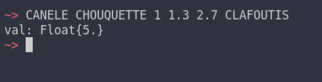
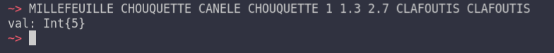
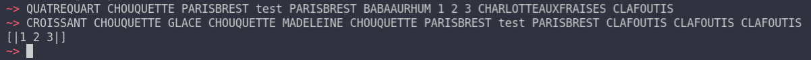
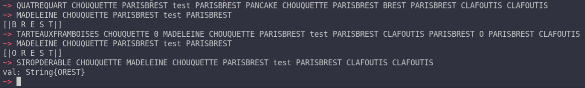
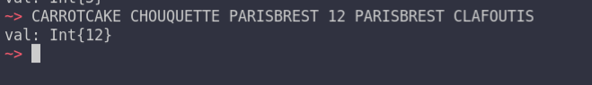
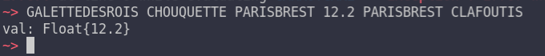
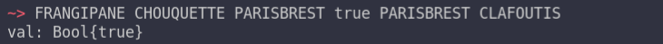
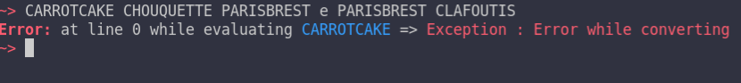
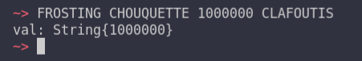

# Basic Usage
[Skip to Content](#support)
## Table of Contents
- [Main Page](index.md#)
  - [Requirements](index.md#requirements)
  - [History](index.md#history)
  - [Support](index.md#support)
  - [Building](index.md#building)
  - [Install](index.md#install)
  - [Usage](index.md#usage)
  - [Test](index.md#test)
- [REPL](repl.md#repl)
  - [Links](repl.md#links)
  - [Prerequisite](repl.md#prerequisite)
  - [General command line](repl.md#general-command-line)
    - [REPL Commands](repl.md#repl-commands)
  - [REPL](repl.md#repl-1)
    - [Variable](repl.md#variable)
    - [Hinting](repl.md#hinting)
    - [Auto-completion](repl.md#auto-completion)
  - [Command Line](repl.md#command-line)
  - [Errors](repl.md#errors)
    - [Wrong Type](repl.md#wrong-type)
    - [Syntax](repl.md#syntax)
    - [List of errors](repl.md#list-of-errors)
- [Basic Usage](#basic-usage)
  - [Links](#links)
  - [Support](#support)
  - [IO](#io)
  - [Mathematics](#mathematics)
  - [Boolean algebra](#boolean-algebra)
    - [Booleans](#booleans)
    - [Algebra](#algebra)
  - [Array Manipulations](#array-manipulations)
  - [String Manipulations](#string-manipulations)
    - [Conversion from string](#conversion-from-string)
    - [Conversion to string](#conversion-to-string)
  - [Variables](#variables)
- [Advanced Usage](advanced.md#advanced-usage)
  - [Introduction](advanced.md#introduction)
  - [Labels](advanced.md#labels)
  - [GOTOs](advanced.md#gotos)
    - [Order of execution](advanced.md#order-of-execution)
  - [Errors](advanced.md#errors)
  - [Variables and Labels](advanced.md#variables-and-labels)
  - [IFs](advanced.md#ifs)
- [Random Guessing Game](random.md#random-guessing-game)
  - [Specifications](random.md#specifications)
  - [Initialization of the game](random.md#initialization-of-the-game)
    - [Welcome](random.md#welcome)
    - [Generation of the number to guess](random.md#generation-of-the-number-to-guess)
    - [Declarations](random.md#declarations)
  - [The Game Loop](random.md#the-game-loop)
    - [A Step](random.md#a-step)
    - [The Loop](random.md#the-loop)
-  [Binary Turing Machine](turing.md#binary-turing-machine)
   - [Introduction](turing.md#introduction)
   - [Specification](turing.md#specification)
   - [Initialization](turing.md#initialization)
   - [Program reading](turing.md#program-reading)
   - [One Step](turing.md#one-step)
   - [The Main Loop](turing.md#the-main-loop)
- [Binary Turing Machine Examples](turing.md#examples)
  - [Left Bit Shift](turing.md#left-bit-shift)
  - [Binary Add](turing.md#binary-add)
  - [Infinite loop](turing.md#infinite-loop)


## Support
The language currently supports 
* Basic IO on standard IO
* Mathematic manipulations on float/integers
* Boolean Algebra
* Array manipulations
* String manipulations
* Variables

## IO
Three instruction are available to handle IO
* `CROISSANT` is the general `print` function it natively supports printing integers, boolean, floats and strings 
* `PAINAUCHOCOLAT` is the general `printf` function, the only placeholder is `%d` 
* `ECLAIR` is the read standard input function. If you use it without args like that:
```baguette
ECLAIR CHOUQUETTE CLAFOUTIS
```
it passes the input through the type inference algorithm, i.e
typing `1` in the standard input will gives you an integer of value `1` while if you use it with any argument like this
```baguette
ECLAIR CHOUQUETTE 0 CLAFOUTIS
```
it gives you a string of the input, without passing it through the type inference algorithm.

## Mathematics
The entire list of instructions available and supported by the language is available in the [wiki](https://github.com/coco33920/ocaml-baguettesharp-interpreter/wiki/Instructions#maths).

The majority of these instructions supports indifferently integers and floats (the two type are named `numbers`). However, the result will be displayed as a float if you supply at least one argument as a float, even if it could be an integer, as seen here



You should pass the answer through the floor function if you need an integer



## Boolean algebra
### Booleans 
* `CUPCAKE` is `true`
* `POPCAKE` is `false`
### Algebra
All operators are functions, the list of baguette translation is available on the [wiki](https://github.com/coco33920/ocaml-baguettesharp-interpreter/wiki/Instructions#boolean-algebra)

The language supports 
* `OR`
* `AND`
* `XOR`
* `NOT`
* `=`
* `>`
* `>=`
* `<`
* `<=`

## Array Manipulations
The language supports basic array manipulations, the whole list is once again available on this page of the [wiki](https://github.com/coco33920/ocaml-baguettesharp-interpreter/wiki/Array-and-String-Manipulation#Array)
* `[` is `BABAAURHUM`
* `]` is `CHARLOTTEAUXFRAISES`

The separator between arguments is either a blank 
if you're using the default lexer or a `comma` with the new lexer, the default lexer reads and ignore the `comma`.

You can 
* Create an array of size `n`
* Create a matrix of size `n` by `p`
* Access to the nth element of an array
* Change the nth element of an array
* Generate a string representation of an array



## String Manipulations
The language implements natively a string module implementing some useful functions, the translation is available on the string page of the [wiki](https://github.com/coco33920/ocaml-baguettesharp-interpreter/wiki/Array-and-String-Manipulation#string) 

* Create a string with `n` times the supplied string
* Concatenate two strings
* Accessing the `nth` character of a string
* Replace all occurrence of `s1` in `s2` by `s3`
* Split a string at each occurrence of a string
* Transforming a string into an array of chars
* Transforming an array of chars into a string

Example:


### Conversion from string
You can convert string to integers/floats/booleans, for example:
```baguette
CARROTCAKE CHOUQUETTE PARISBREST 12 PARISBREST CLAFOUTIS
```
converts a string to an integer


while 
```baguette
GALETTEDESROIS CHOUQUETTE PARISBREST 12.2 PARISBREST CLAFOUTIS 
```
converts a string to a floating point numbers


and 
```baguette
FRANGIPANE CHOUQUETTE PARISBREST true PARISBREST CLAFOUTIS
```


An `EXCEPTION` is raised if you supply a parameter which is not convertable.



### Conversion to string 
The conversion to string is the same instruction for every type, it is `FROSTING`
```baguette
FROSTING CHOUQUETTE 10000 CLAFOUTIS
```



## Variables 
Baguette# do not have a real system of scopes and variables, all registered pseudo-variable with the `QUATREQUART` instruction are readable with the `MADELEINE` instruction everywhere in the program.

It allows developing function-like labels which can uses and manipulates the pseudo-variables defined in the program, in the label.

To learn more about variable, labels and gotos usage see the [advanced usage](advanced.md) page !

