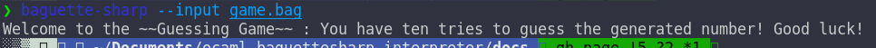
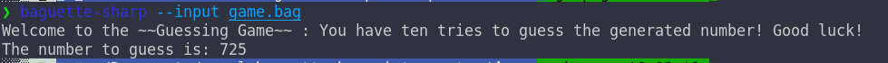
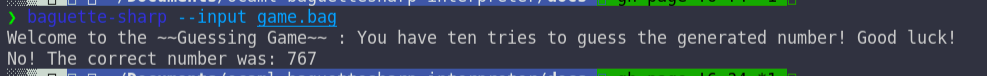
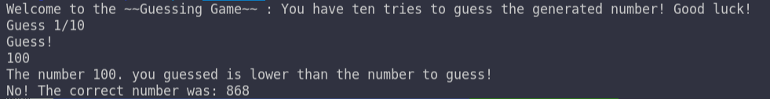
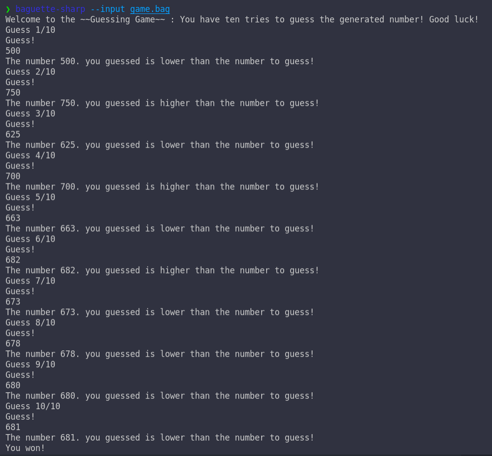

# Random Guessing Game
We will here develop a random guessing game.

[Skip To Content](#specifications)

## Table of Contents
- [Main Page](index.md)
  - [Requirements](index.md#requirements)
  - [History](index.md#history)
  - [Support](index.md#support)
  - [Building](index.md#building)
  - [Install](index.md#install)
  - [Usage](index.md#usage)
  - [Test](index.md#test)
- [REPL](repl.md#repl)
  - [Links](repl.md#links)
  - [Prerequisite](repl.md#prerequisite)
  - [General command line](repl.md#general-command-line)
    - [REPL Commands](repl.md#repl-commands)
  - [REPL](repl.md#repl-1)
    - [Variable](repl.md#variable)
    - [Hinting](repl.md#hinting)
    - [Auto-completion](repl.md#auto-completion)
  - [Command Line](repl.md#command-line)
  - [Errors](repl.md#errors)
    - [Wrong Type](repl.md#wrong-type)
    - [Syntax](repl.md#syntax)
    - [List of errors](repl.md#list-of-errors)
- [Basic Usage](basic.md/#basic-usage)
  - [Links](basic.md/#links)
  - [Support](basic.md#support)
  - [IO](basic.md#io)
  - [Mathematics](basic.md#mathematics)
  - [Boolean algebra](basic.md#boolean-algebra)
    - [Booleans](basic.md#booleans)
    - [Algebra](basic.md#algebra)
  - [Array Manipulations](basic.md#array-manipulations)
  - [String Manipulations](basic.md#string-manipulations)
    - [Conversion from string](basic.md#conversion-from-string)
    - [Conversion to string](basic.md#conversion-to-string)
  - [Variables](basic.md#variables)
- [Advanced Usage](advanced.md#advanced-usage)
  - [Introduction](advanced.md#introduction)
  - [Labels](advanced.md#labels)
  - [GOTOs](advanced.md#gotos)
    - [Order of execution](advanced.md#order-of-execution)
  - [Errors](advanced.md#errors)
  - [Variables and Labels](advanced.md#variables-and-labels)
  - [IFs](advanced.md#ifs)
- [Random Guessing Game](#random-guessing-game)
  - [Specifications](#specifications)
  - [Initialization of the game](#initialization-of-the-game)
    - [Welcome](#welcome)
    - [Generation of the number to guess](#generation-of-the-number-to-guess)
    - [Declarations](#declarations)
  - [The Game Loop](#the-game-loop)
    - [A Step](#a-step)
    - [The Loop](#the-loop)
-  [Binary Turing Machine](turing.md#binary-turing-machine)
   - [Introduction](turing.md#introduction)
   - [Specification](turing.md#specification)
   - [Initialization](turing.md#initialization)
   - [Program reading](turing.md#program-reading)
   - [One Step](turing.md#one-step)
   - [The Main Loop](turing.md#the-main-loop)
- [Binary Turing Machine Examples](turing.md#examples)
  - [Left Bit Shift](turing.md#left-bit-shift)
  - [Binary Add](turing.md#binary-add)
  - [Infinite loop](turing.md#infinite-loop)

## Specifications
This game must
* Generate a random integer between 0 and 1000
* Ask the user for a guess
* Prints out if their guess is bellow or over the generated or if they guessed right
* Do that ten times

## Initialization of the game
We will code in the `game.bag` file
First we to print out the basic of the game, with `CROISSANT`
### Welcome
`game.bag`
```baguette
CROISSANT CHOUQUETTE PARISBREST Welcome to the ~~Guessing Game~~ : You have ten tries to guess the generated number! Good luck! PARISBREST CLAFOUTIS BAGUETTE
```
testing the output gives



### Generation of the number to guess
We then need to generate a random number, with the `BRETZEL` instruction. Stores it in a variable named for example 
`number`, and we can print it for debugs purposes.

`game.bag`
```baguette
CROISSANT CHOUQUETTE PARISBREST Welcome to the ~~Guessing Game~~ : You have ten tries to guess the generated number! Good luck! PARISBREST CLAFOUTIS BAGUETTE
QUATREQUART CHOUQUETTE PARISBREST number PARISBREST BRETZEL CHOUQUETTE 0 1000 CLAFOUTIS CLAFOUTIS
PAINAUCHOCOLAT CHOUQUETTE PARISBREST The number to guess is: %d PARISBREST MADELEINE CHOUQUETTE PARISBREST number PARISBREST CLAFOUTIS CLAFOUTIS 
```
which outputs



### Declarations
We will need a variable to store the current guess of the player. We will initialize it at -1 which is not in the realm 
of the game. We will call it this variable `current_guess`. We need to initialize a variable `i` at 1 which will be our current guess on the 10 available
Finally, we must compare it to the generated number and prints if the user was right!

The equality operator is `TIRAMISU` and the negation is `CHAUSSONAUXPOMMES`. 
We finally have the following code:

`game.bag`
```baguette
CROISSANT CHOUQUETTE PARISBREST Welcome to the ~~Guessing Game~~ : You have ten tries to guess the generated number! Good luck! PARISBREST CLAFOUTIS BAGUETTE
QUATREQUART CHOUQUETTE PARISBREST number PARISBREST BRETZEL CHOUQUETTE 0 1000 CLAFOUTIS CLAFOUTIS BAGUETTE
QUATREQUART CHOUQUETTE PARISBREST current_guess PARISBREST -1 CLAFOUTIS BAGUETTE

SABLE TIRAMISU CHOUQUETTE MADELEINE CHOUQUETTE PARISBREST number PARISBREST CLAFOUTIS MADELEINE CHOUQUETTE PARISBREST current_guess PARISBREST CLAFOUTIS CLAFOUTIS 
FRAMBOISIER MUFFIN 
    CROISSANT CHOUQUETTE PARISBREST You won! PARISBREST CLAFOUTIS
COOKIES BAGUETTE 
SABLE CHAUSSONAUXPOMMES CHOUQUETTE TIRAMISU CHOUQUETTE MADELEINE CHOUQUETTE PARISBREST number PARISBREST CLAFOUTIS MADELEINE CHOUQUETTE PARISBREST current_guess PARISBREST CLAFOUTIS CLAFOUTIS CLAFOUTIS
FRAMBOISIER MUFFIN 
    PAINAUCHOCOLAT CHOUQUETTE PARISBREST No! The correct number was: %d PARISBREST MADELEINE CHOUQUETTE PARISBREST number PARISBREST CLAFOUTIS CLAFOUTIS
COOKIES BAGUETTE
```
After running it we have



## The Game Loop
Now that we initialized the game and prepare for the win we need to develop the game, and for this we will need to develop a game loop!
### A Step
First we will define a label that is one step of the game, i.e.
* Displaying the player the current guessing number and asking them a new guess
* Storing it in the `current_guess` variable
* Prints if the guess is higher/lower than the number to guess
* Increments `i` by one

Labels must be at the top of the file. The instruction to read standard input is `ECLAIR`. The `<=` is `MERINGUE` and we will use the `>` (`TARTE`) instead of the negation of `<=`

`game.bag`
```baguette
ICECREAM PARISBREST step PARISBREST
MUFFIN
    PAINAUCHOCOLAT CHOUQUETTE PARISBREST Guess %d/10 PARISBREST MADELEINE CHOUQUETTE PARISBREST i PARISBREST CLAFOUTIS CLAFOUTIS
    CROISSANT CHOUQUETTE PARISBREST Guess! PARISBREST CLAFOUTIS
    QUATREQUART CHOUQUETTE PARISBREST current_guess PARISBREST ECLAIR CHOUQUETTE CLAFOUTIS CLAFOUTIS
    QUATREQUART CHOUQUETTE PARISBREST i PARISBREST CANELE CHOUQUETTE 1 MADELEINE CHOUQUETTE PARISBREST i PARISBREST CLAFOUTIS CLAFOUTIS CLAFOUTIS
    SABLE MERINGUE CHOUQUETTE MADELEINE CHOUQUETTE PARISBREST current_guess PARISBREST CLAFOUTIS MADELEINE CHOUQUETTE PARISBREST number PARISBREST CLAFOUTIS CLAFOUTIS
    FRAMBOISIER MUFFIN 
        PAINAUCHOCOLAT CHOUQUETTE PARISBREST The number %d you guessed is lower than the number to guess! PARISBREST MADELEINE CHOUQUETTE PARISBREST current_guess PARISBREST CLAFOUTIS CLAFOUTIS
    COOKIES 
    SABLE TARTE CHOUQUETTE MADELEINE CHOUQUETTE PARISBREST current_guess PARISBREST CLAFOUTIS MADELEINE CHOUQUETTE PARISBREST number PARISBREST CLAFOUTIS CLAFOUTIS 
    FRAMBOISIER MUFFIN 
        PAINAUCHOCOLAT CHOUQUETTE PARISBREST The number %d you guessed is higher than the number to guess! PARISBREST MADELEINE CHOUQUETTE PARISBREST current_guess PARISBREST CLAFOUTIS CLAFOUTIS
    COOKIES BAGUETTE
COOKIES BAGUETTE
[code...]
```

adding a `PAINVIENNOIS PARISBREST step PARISBREST` to the code prints the following



### The loop
We need to emulate a `for` loop. We will create another LABEL called `run` which will compare the value of `i` with `10`
and act on consequence. We can put a `IF` statement in `run` that will call `run` each time a certain condition have been met. And put our code (for instance calling `step`) *before* the statement. This emulates a conditional loop (a `while` loop) we can use.

`game.bag`
```baguette
[...]
ICECREAM PARISBREST run PARISBREST
MUFFIN
    PAINVIENNOIS PARISBREST step PARISBREST 
    SABLE MERINGUE CHOUQUETTE MADELEINE CHOUQUETTE PARISBREST i PARISBREST CLAFOUTIS 10 CLAFOUTIS 
    FRAMBOISIER MUFFIN
        PAINVIENNOIS PARISBREST run PARISBREST
    COOKIES BAGUETTE
COOKIES BAGUETTE
[...]
```

And call the `run` label just after the initializing of the game.

The whole game running:



You can see I proceeded by dichotomy, as the logarithm in base 2 of 1000 is a little under 2 (2^10 = 1024) this "game" 
converges in ten steps. To avoid that and making a true luck game we can do 8 steps. 2^8 = 256 so the game should not be too hard nor this easy to win.
The last "the number is lower" is because I used `<=` to make the comparison. To make this game a true game we should add another label which's job is to check for equality and run it after the `step` call in the game loop. But this is irrelevant as this page's goal is to demonstrate loops not coding a game.

You can find the code for this game [here](game.bag)