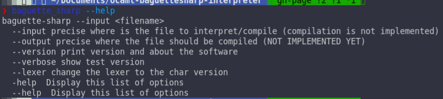
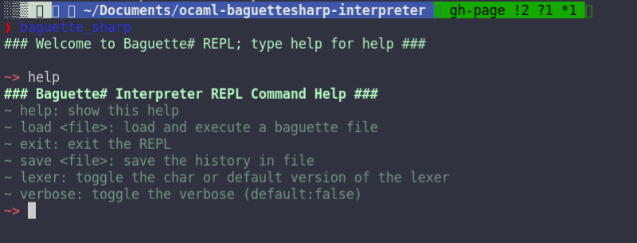
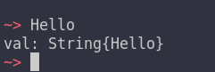
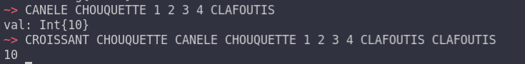
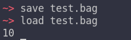
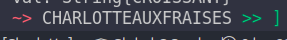
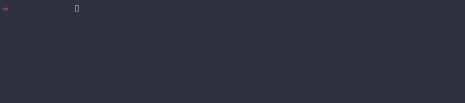
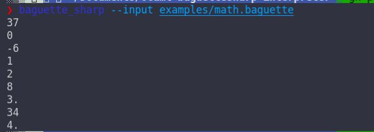
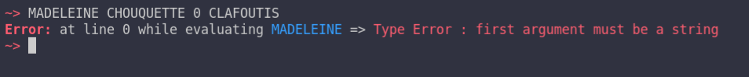
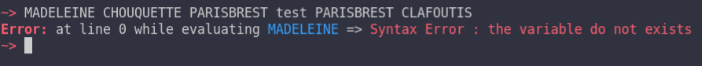

# Command Line and REPL
## Prerequisite
The executable of baguette-sharp, either from the precompiled binaries downloadable in the header
or from compiling/installing the project with 
```bash
dune build/install
```
here the executable is assumed to be `baguette_sharp` and in the `$PATH`

## General command line
typing in a terminal
```bash
baguette_sharp --help
```
gives you the help of the command which is



* `--input` is the location of the input file to interpret
* `--output` is **not** implemented yet
* `--verbose` toggle the verbose on (default is false) which
shows the lexed code and prints the AST before interpreting it
* `--version` prints a nice little 'about me' line
* `--lexer` toggle the char version of the lexer on (default is off)

### REPL Commands
Not specifying an input file launch the REPL for example `baguette_sharp` alone launch the REPL



The REPL top commands are the following
* `help` shows the displayed help
* `load <file>` loads an external baguette file (note this supports auto-completion)
* `save <file>` saves the history of `Baguette#` commands in the specified file 
* `verbose` toggle the verbose on/off (default is off)
* `lexer` toggle the new lexer on/off (default is off)
* `exit` exit the REPL

N.B the following command are equivalent:
```
baguette_sharp --verbose
```
and 
```
baguette_sharp
```
then toggling `verbose` on. Same with the lexer

## REPL
### Variable
By default the REPL shows the information about an incoming variable.<br/>
The example bellow shows what happens when typing only `Hello` in the prompt



And the difference between adding and printing the addition:



The same code interpreted through a file only shows the latter 



### Hinting
The REPL shows hint when a function / keyword is typed<br/>
**Function**


**Keyword**



### Auto-completion
Lastly the REPL editor uses `Linenoise` to provide auto-completion when using baguette commands



## Command Line

The Command Line Version of Baguette# just execute the file
for example
```bash
baguette_sharp --input examples/math.baguette
```
Shows



## Errors
In the last version (2.0) of Baguette# a real system of errors (without the way of handling them just yet though) has been implemented. Here is some example

### Wrong Type


The error was raised because `MADELEINE` take a string as parameter and `0` is an integer

### Syntax


The error was raised because the variable `test` we were trying to access do not exist

### List of errors
there is _ types of error
* `Wrong Type Error` raised when you supply a parameter of a wrong type
* `Syntax Error` for errors relating to runtime and/or syntax
* `Out Of Bound Error` raised when you try to access an element of an array which do not exist (ex element 5 of an array of size 3)
* `Argument Error` when you supply not enough arguments for an instruction
* `Error` for the other types of errors.