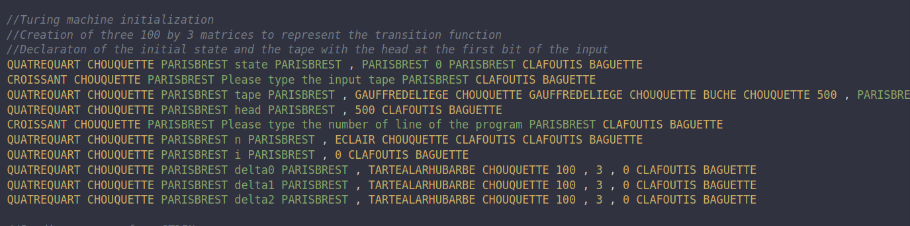
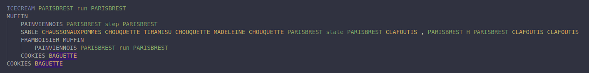
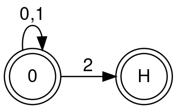
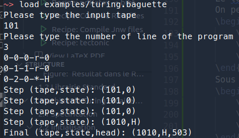
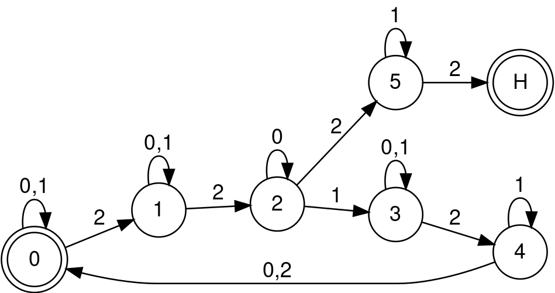
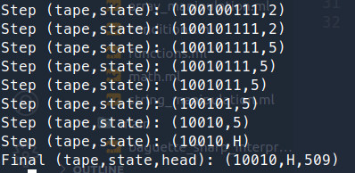
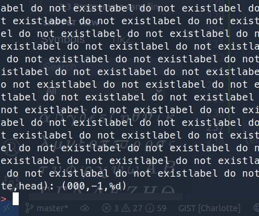

# Binary Turing Machine
[Skip to Content](#introduction)
- [Main Page](index.md#)
  - [Requirements](index.md#requirements)
  - [History](index.md#history)
  - [Support](index.md#support)
  - [Building](index.md#building)
  - [Install](index.md#install)
  - [Usage](index.md#usage)
  - [Test](index.md#test)
- [REPL](repl.md#repl)
  - [Links](repl.md#links)
  - [Prerequisite](repl.md#prerequisite)
  - [General command line](repl.md#general-command-line)
    - [REPL Commands](repl.md#repl-commands)
  - [REPL](repl.md#repl-1)
    - [Variable](repl.md#variable)
    - [Hinting](repl.md#hinting)
    - [Auto-completion](repl.md#auto-completion)
  - [Command Line](repl.md#command-line)
  - [Errors](repl.md#errors)
    - [Wrong Type](repl.md#wrong-type)
    - [Syntax](repl.md#syntax)
    - [List of errors](repl.md#list-of-errors)
- [Basic Usage](basic.md#basic-usage)
  - [Links](basic.md#links)
  - [Support](basic.md#support)
  - [IO](basic.md#io)
  - [Mathematics](basic.md#mathematics)
  - [Boolean algebra](basic.md#boolean-algebra)
    - [Booleans](basic.md#booleans)
    - [Algebra](basic.md#algebra)
  - [Array Manipulations](basic.md#array-manipulations)
  - [String Manipulations](basic.md#string-manipulations)
    - [Conversion from string](basic.md#conversion-from-string)
    - [Conversion to string](basic.md#conversion-to-string)
  - [Variables](basic.md#variables)
- [Advanced Usage](advanced.md#advanced-usage)
  - [Introduction](advanced.md#introduction)
  - [Labels](advanced.md#labels)
  - [GOTOs](advanced.md#gotos)
    - [Order of execution](advanced.md#order-of-execution)
  - [Errors](advanced.md#errors)
  - [Variables and Labels](advanced.md#variables-and-labels)
  - [IFs](advanced.md#ifs)
- [Random Guessing Game](random.md#random-guessing-game)
  - [Specifications](random.md#specifications)
  - [Initialization of the game](random.md#initialization-of-the-game)
    - [Welcome](random.md#welcome)
    - [Generation of the number to guess](random.md#generation-of-the-number-to-guess)
    - [Declarations](random.md#declarations)
  - [The Game Loop](random.md#the-game-loop)
    - [A Step](random.md#a-step)
    - [The Loop](random.md#the-loop)
- [Binary Turing Machine](#binary-turing-machine)
  - [Introduction](#introduction)
  - [Specification](#specification)
  - [Initialization](#initialization)
  - [Program reading](#program-reading)
  - [One Step](#one-step)
  - [The Main Loop](#the-main-loop)
- [Examples](#examples)
  - [Left Bit Shift](#left-bit-shift)
  - [Binary Add](#binary-add)
  - [Infinite loop](#infinite-loop)


## Introduction
Here is the "tutorial" explaining the implementation of a Binary Turing Machine in Baguette#  
The machine is based on this [python](https://sandipanweb.wordpress.com/2020/08/08/simulating-a-turing-machine-with-python-and-executing-programs/) machine and adapted for Baguette#, it served to implement String and Array manipulation instruction in B#.  
The present page is translated from the French [TIPE report](https://github.com/coco33920/rapport_tipe).

## Specification
An infinite RAM is not possible in real life, so here is the specification of the implemented machine
- The tape is of length 1000 initialized with *2* characters because as a binary machine 2 is not part of the alphabet (which is $\{0,1\}$)
- The input is placed at the index 500 and the head is placed at the first character of the input 
- Programs are a list of lines of form STATE-READ-TOWRITE-DIRECTION-NEWSTATE, e.g. if when we read a 1 in the 0 state we 
move right, and we transfer to machine state 1 we will write $0-1-2-r-1$
- The limit, for performance reason is 100 states, but this number is modifiable in the code (when matrices are created)
- The end state is $H$, a right translation of the head is $r$, a left translation is $l$ and a null-translation is $*$
  
## Initialization 
The code of the initialization is shown bellow  
      
In the first line we init the initial state of the machine to "0", we then ask the input tape to the user (the input of the program). The next line is not entirely shown, it initialize the tape as a 500 length "22..." string then the input then a 500 length "22..." string.  
The most important thing here is the *TARTEALARHUBARBE* instruction call, it constructs a matrix of size $n$ by $p$ (here 100 by 3) initialized with 0 everywhere. These three matrices will store the program. Two other variable $n$ and *i* are there to control the program loop, $n$ is the number of line of the program and $i$ is init at 0 (this will be the variable of looping)  

## Program reading
To read on the standard input, we must emulate a conditional loop, the Baguette# do not implement loops natively. We will use for that goal the two predefined variable $n$ and $i$, the instruction *ICECREAM \<string>* to construct **LABELS**, the *PAINVIENNOIS \<string>* instruction to **JUMP** to the designed *label*, and finally a conditional test, **SABLE \<condition> \<label>**  

Here is the algorithm of the program reading loop  
* Read STDIN
* Split the line at each `-` character 
* Fill the three defined matrices with corresponding part of the program (see [here](#initialization))
* Increment $i$
* Check if $i$ is superior or equal to $n$
* If $i\geq n$ then it quit the loop
* If $i<n$ it **JUMP** to itself

This algorithm implemented gives twenty-three lines of code available on [GitHub](https://github.com/coco33920/ocaml-baguettesharp-interpreter/blob/master/examples/turing.baguette#L3)  
Once this algorithm is completed we have read the whole program

## One Step
We then need to implement a *step* of the program. We will also use a **LABEL** to separate this from the main code and allow the future run-loop to work. The *labels* are not properly functions, the *scopes* of the whole program is shared regardless where we are, this allows us to approximately emulate how functions works with labels. The most used instruction will be *TARTEAUXFRAISES*, which is the access of the *n-th* element of an array.  

A step should do these steps
* Verify the current machine state is different from $H$. The following steps are in the case when this is $true$
* Read the tape where the reading head is and obtain the state of the tape noted $e$, the state of the machine is $s$
* Access what we should write in the first matrix at coordinates $(s,e)$
* Access the direction we should translate the head in with the second matrix at coordinates $(s,e)$
* Access the new state of the machine in the third matrix at coordinates $(s,e)$
* Modify the tape with what we should write
* Update the machine state with the new state
* Translates the head according to if we read $r$, $l$ or $*$
* Prints the tapes (without the 2s) and the state of the machine
  
The implementation in Baguette# of this code is available on [GitHub](https://github.com/coco33920/ocaml-baguettesharp-interpreter/blob/master/examples/turing.baguette#L26), until the 58th line. This piece of code is only performing *one* step. We now need to implement the main loop.

## The Main Loop

Now we have a step of the machine, we need to repeat the steps until the machine state is $H$.
We will see in the examples what happens what the program do when it is confronted to a never ending program/input for a program which does not always end.  

Here again we have a conditional loop to implement. We will again use a **LABEL** and a conditional test **IF**.

<div style="margin:auto; text-align: center">

</div>

Which can translates to "while machine state is not "H", call step".  
Finally, we need to add a **JUMP** to "run" just after the initialization, to launch the program : 

```b#
PAINVIENNOIS PARISBREST run PARISBREST
```

# Examples
## Left Bit Shift

The left bit shift is a binary multiplication by two, it's "translating the bits" of one rank towards the left, effectively adding a $0$ at the end of the binary input.

We can do it with the following algorithm:
* If we're in the machine state $0$ and reads a $0$ we write a $0$, moves the head to the right, and we stay in the state $0$
* If we're in the machine state $0$ and reads a $1$ we write a $1$, moves the head to the right, and we stay in the state $0$
* If we're in the machine state $0$ and reads a $2$ we write a $0$, do not move the head, and we pass to the state $H$  

In an automata (transition are from machine state to machine state labelled by tape reading) it gives that  


<div style="margin:auto; text-align: center">

</div>

and in form of a program readable by the Turing Machine we have
```turing
0-0-0-r-0
0-1-1-r-0
0-2-0-*-H
```

Executing it gives


<div style="margin:auto; text-align: center">

</div>


## Binary Add
A binary adder is way more complex, the program adapted for the turing machine is seventeen lines long (and will not be properly explained here), in short, it uses the second number as a counter to add one by one to the first number until the counter is at 0.  

The automata representation gives this  :

<div style="margin:auto; text-align: center">

</div>

The whole program is available on the [GitHub](https://github.com/coco33920/ocaml-baguettesharp-interpreter/blob/master/examples/turing_programs.txt#L5).

The execution for the addition of 10 and 8 (in binary 1010 and 1000) gives 10010 which is 16+2 = 18. 


<div style="margin:auto; text-align: center">

</div>

## Infinite loop
Let the following program
```
0-0-0-*-1
1-0-0-*-0
```
It writes nothing, stays on the same cell, and alternate between state $0$ and $1$, thus never passing to state $H$ and never finishing.  
Executing it makes the interpreter print a lot of error codes until it stops executing the program and loop back to the REPL.


<div style="margin:auto; text-align: center">

</div>


